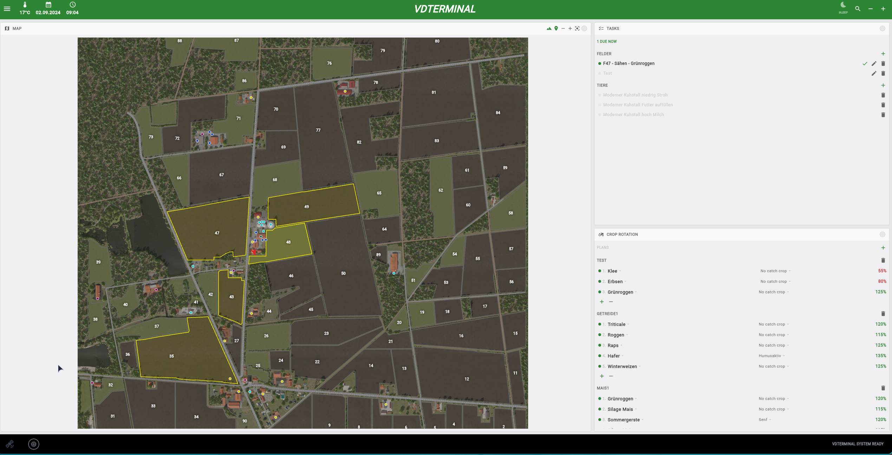
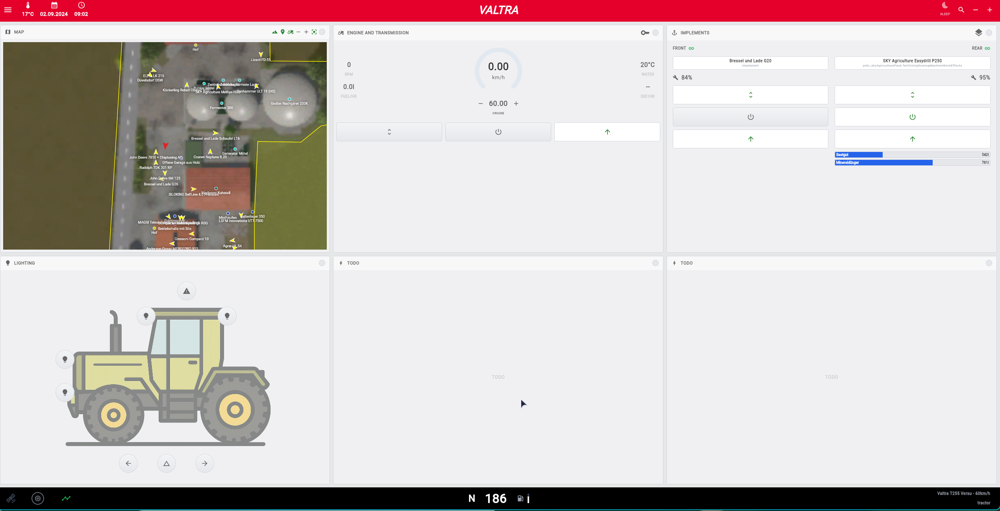
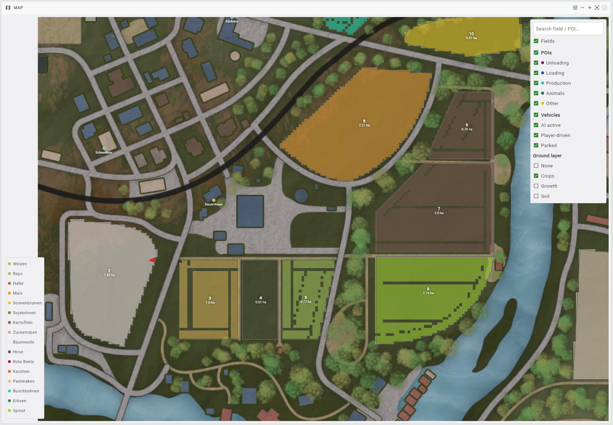
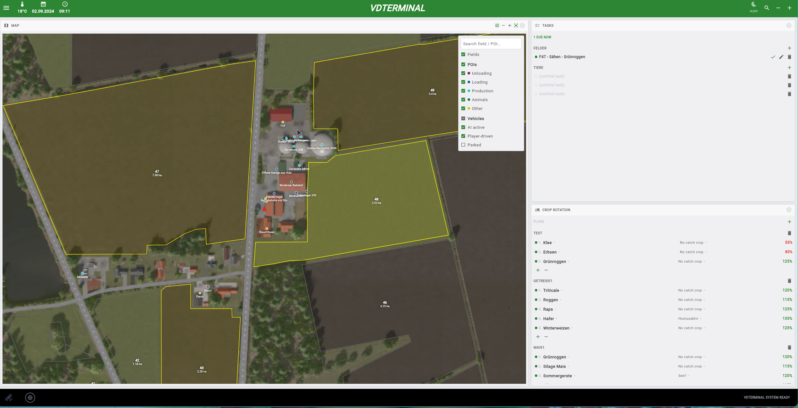
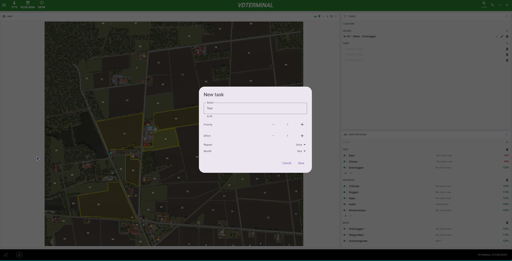

# VDTelemetry

**Just want to run it?** → [Setup guide (English)](docs/setup.en.md) ·
[Anleitung (Deutsch)](docs/setup.de.md) · [Downloads](https://github.com/VertexDezign/VDTelemetry/releases)

A telemetry pipeline for **Farming Simulator 25**, in two parts:

- **[`vdTelemetry/`](vdTelemetry/Readme.md)** — the in-game mod (Lua) that exports live game
  state to `vdTelemetry.json` and a set of sibling channel files, and takes commands back through a
  command channel.
- **[`VDTerminal/`](VDTerminal/README.md)** — a Kotlin Multiplatform app that watches those files
  and renders a live web dashboard, on this machine or on a tablet or phone on the LAN.

The shared Kotlin model (`VDTerminal/shared/.../model/`) plus the `examples/json/` fixtures are
the contract between the two: changing the data shape means changing the Lua collectors and the
Kotlin model together, and refreshing the fixtures.

Requirements: the mod needs [FS25_additionalInputs](https://github.com/VertexDezign/AdditionalInputs);
the terminal needs JDK 21+ and a WasmGC-capable browser. Each README has the full story — how the mod
is configured and what each channel carries, and how to run the terminal in development or as a single
production process.



| | |
|---|---|
|  |  |
|  |  |

## Planned and deferred work

**[`FUTURE.md`](FUTURE.md)** collects everything planned, deferred or still open across the whole
repo — the follow-ups finished work left behind and the in-game checks nobody has run. Read it before
proposing something that looks new; it may already be there, with the reason it was left. (A limitation
that is accepted rather than open is a decision, not future work, and lives with the feature it belongs
to.)

## Commit messages

Commit subjects follow:

```
<issue> <modifier> <[area]> <subject>
```

where **issue** and **area** are optional — for example
`LS42-8 ✨ [ui] add short-url filtering`.

- **issue** – `LS42-8` (`<PROJECT>-<number>`) or `#8`.
- **modifier** – a gitmoji describing the kind of change. Write the emoji
  directly, or use the one-letter shorthand below; the local `commit-msg` hook
  rewrites the shorthand to the emoji on commit:

  | shorthand | emoji | meaning                        |
  |-----------|-------|--------------------------------|
  | `+`       | ✨    | new feature                    |
  | `!`       | 🚑    | bug fix                        |
  | `-`       | 🔥    | remove code                    |
  | `r`       | 🔨    | refactor (no behavior change)  |
  | `c`       | 📖    | documentation only             |
  | `t`       | 🚨    | tests                          |
  | `v`       | ⬆️    | upgrade dependencies / versions |
  | `b`       | 💚    | CI                             |
  | `i`       | 🎉    | initial / project setup        |

- **area** – the affected scope in brackets, e.g. `[ui]`, `[service]`,
  `[common]`.
